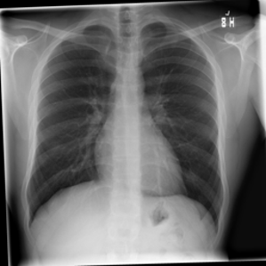
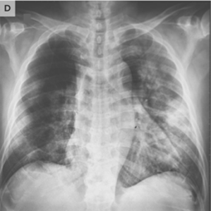
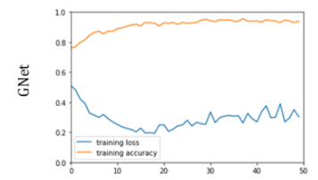
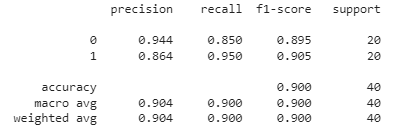

# Classification of changes related to COVID-19 on X-rays

The aim of the study was to find a classification algorithm with the highest possible accuracy that could be used as a tool for COVID-19 diagnosis based on lung X-ray images.

## Introduction 
The COVID-19 epidemic began on November 17, 2019 in Wuhan, China, and was declared a pandemic by WHO on March 11, 2020. Symptoms of the disease are cough, fever and shortness of breath - due to complications, pneumonia or acute respiratory distress syndrome may develop. . The total number of cases since the start of the pandemic is estimated at 170 million.

COVID-19 disease can be diagnosed not only with nasopharyngeal swabs but also X-rays can be used. Few doctors are able to make a diagnosis based on the image of the lungs. Unfortunately, in times of a pandemic, the health service is particularly overloaded, which makes it difficult to access a specialist. Additionally, any contact with a potentially infected person poses a risk to medical personnel. Therefore, it is worth considering the issue of early detection of pneumonia caused by COVID-19 using deep learning methods. Finding the most effective algorithm will help healthcare professionals and increase the credibility of their diagnoses.

The images below present normal image of the lungs (left) and with changes due to COVID19 (right).

    

        
        
    

## Database
The X-ray images used in teaching the network came from a collection made available on the [Kaggle](https://www.kaggle.com/tawsifurrahman/covid19-radiography-database?select=COVID-19_Radiography_Dataset) website. This collection includes chest X-ray pictures of healthy patients (Normal class), diagnosed with COVID-19 (COVID class), patients with detected pulmonary opacity (Lung_Opacity class) and patients
with viral pneumonia (Viral Pneumonia class). 

For the purposes of this project, a smaller set was separated from the database and the photos were scaled to the size of 224x224 pixels. 100 X-ray pictures of the lungs of people with COVID and the same number of X-rays of the lungs of healthy people were used.

  * *Training data:* 70% = 140 images

  * *Test data:* 20% = 40 images

  * *Validation data:* 10% = 20 images

## Methods
The Colab environment was used during the implementation of the project. The project was made using the TensorFlow library. It is an open source machine learning library. The sklearn library was used to visualize the results. It made it possible to prepare a classification report and a matrix of errors.

## [Network architecture](https://github.com/Swedeling/Portfolio/blob/main/Covid-19%20classification/COVID-19%20classification.ipynb)
In accordance with the assumptions of the project, an attempt was made to implement the network for the classification of changes related to COVID-19 on X-ray images. A convolutional network consisting of a total of 14 layers (convolutional, MaxPooling and FCL) was created. For the purposes of the project, it was named GNet. The process of creating the network consisted in creating a core network and modifying the input parameters. The impact of changes on learning outcomes was checked. New layers were removed and added, and parameters such as filter size, pool_size, stride, padding, the number of filters and the activation function were modified. When the result was considered satisfactory, the design process was completed. A schematic diagram of the network architecture is shown below.

## Results
High results of 90% were achieved. They are shown in the pictures below.

The first graph shows the value of the loss function and the accuracy for the training set.

    

Below you will find a summary of the values of the most popular validation metrics: *accuracy, precision, recall* and *F1-score*.

    

## Conclusions and future explorations 
The obtained results of the classification are good - accuracy equal to 90%. With a small file containing only 200 photos, this is a high result. However, a classification accuracy of 100% is desirable. The achieved result can be improved, inter alia, by increasing the amount of processed data (increasing the volume of the training set). Also an augmentation may be a good solution in this case.

Ultimately, neural convolutional networks have proved to be a good tool for identifying COVID-19 from X-rays, which could be further improved in the future.

## Bibliography
[1] A. Narin, C. Kaya, i Z. Pamuk, „Automatic detection of coronavirus disease (COVID-19) using X-ray images and deep convolutional neural networks”, Pattern Anal. Appl., maj 2021, doi: 10.1007/s10044-021-00984-y. 

[2] www.en.wikipedia.org/wiki/COVID-19 

[3] www.github.com/CSSEGISandData/COVID-19 

[4] M. M. Rahaman i in., „Identification of COVID-19 samples from chest X-Ray images using deep learning: A comparison of transfer learning approaches”, J. X-Ray Sci. Technol., t. 28, nr 5, s. 821–839, wrz. 2020, doi: 10.3233/XST-200715. 

[5] A. P. Adedigba, S. A. Adeshina, O. E. Aina, i A. M. Aibinu, „Optimal hyperparameter selection of deep learning models for COVID-19 chest X-ray classification”, Intell.-Based Med., t. 5, s. 100034, 2021, doi: 10.1016/j.ibmed.2021.100034. 

[6] P. Saha, M. S. Sadi, i Md. M. Islam, „EMCNet: Automated COVID-19 diagnosis from X-ray images using convolutional neural network and ensemble of machine learning classifiers”, Inform. Med. Unlocked, t. 22, s. 100505, 2021, doi: 10.1016/j.imu.2020.100505. 

[7] www.ichi.pro/pl/przeglad-roznych-optymalizatorow-dla-sieci-neuronowych-247308806799555 

[8] R. M. Pereira, D. Bertolini, L. O. Teixeira, C. N. Silla, i Y. M. G. Costa, „COVID-19 identification in chest X-ray images on flat and hierarchical classification scenarios”, Comput. Methods Programs Biomed., t. 194, s. 105532, paź. 2020, doi: 10.1016/j.cmpb.2020.105532. 