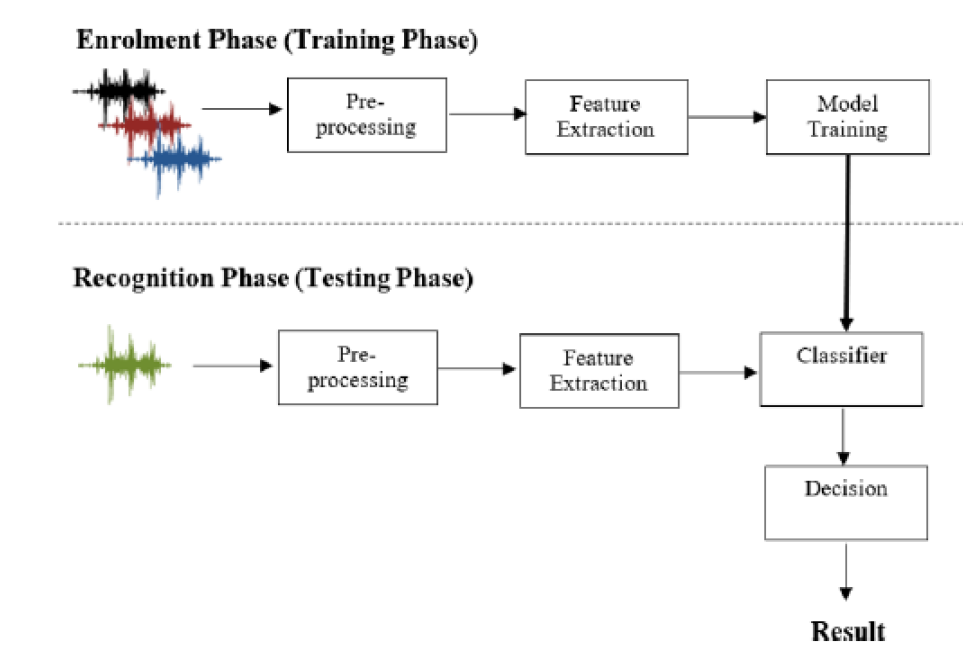
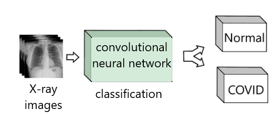
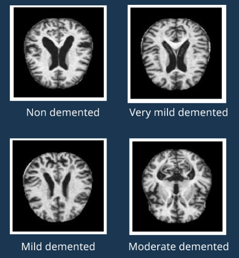

# AI/ML Projects
In this repo you can see my AI/ML projects.

## [Speaker Recognition](https://github.com/Swedeling/Portfolio/tree/main/SpeakerRecognition)

This project is part of my engineering thesis "Automatic Identity Recognition Using Speech Biometric". The main assumptions of the project include creating the most effective solution that will enable the identification of 34 speakers based on 14 recordings of individual words from each of them. I show you step by step how I managed to achieve the results of 98%. 

    

        
    

*[Mohd Hanifa, Rafizah, Khalid Isa, i Shamsul Mohamad. „A Review on Speaker Recognition: Technology and Challenges”. Computers & Electrical Engineering 90 (marzec 2021): 107005. https://doi.org/10.1016/j.compeleceng.2021.107005.]*

## [Classification of changes related to COVID-19 on X-rays](https://github.com/Swedeling/Portfolio/blob/main/Covid-19%20classification/README.md)

This project is an attempt to create a system for the automatic classification of  x-rays in the context of COVID-19. The aim of the study was to find a classification algorithm with the highest possible accuracy that could be used as a tool for COVID-19 diagnosis based on lung X-ray images. Due to the classification of the images, a convolutional network architecture was selected. Ultimately, results were achieved at the level of 90%. 

    

        
    

## [Classification of changes related to Alzheimer's disease on MRI images](https://github.com/Swedeling/Portfolio/tree/main/Alzheimer's%20classification)

The aim of the project is designing an accurate architecture for the classification of Alzheimers Disease severity on the basis of MRI images. The Dataset was divided into four classes of images (Non Demented, Very Mild Demented, Mild Demented, Moderate Demented). Two methods were used: logistic regression (2 models) and convolutional networks (5 models). Finally, result were achieved at the level of 99%. 

    

        
    

