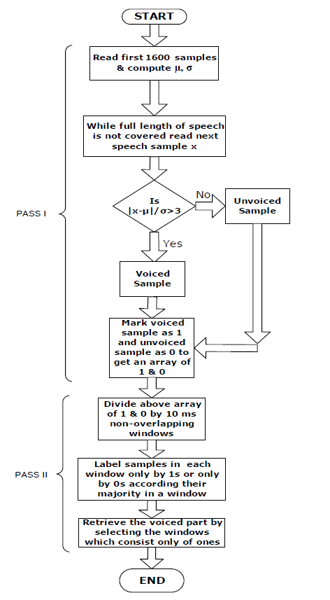
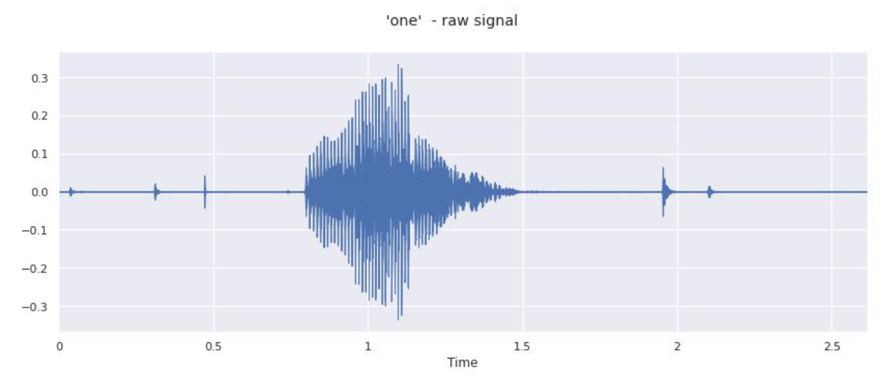
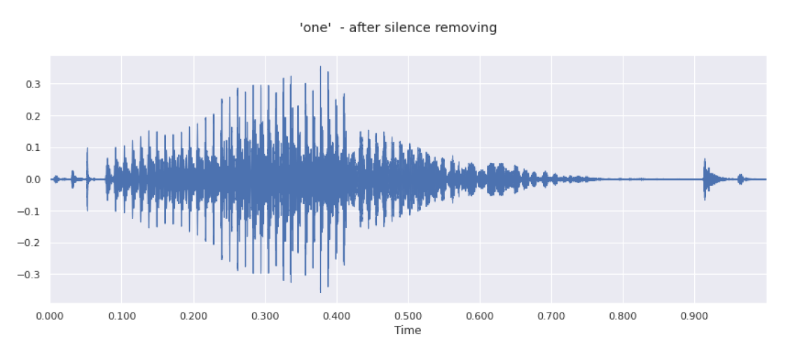
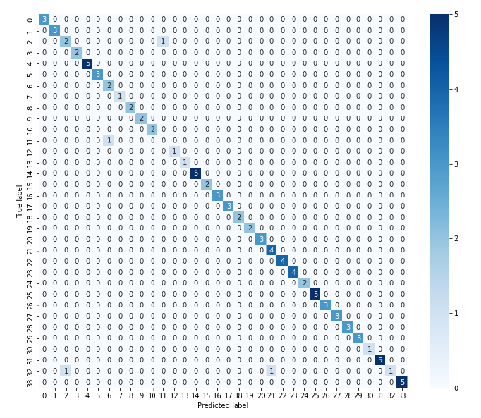
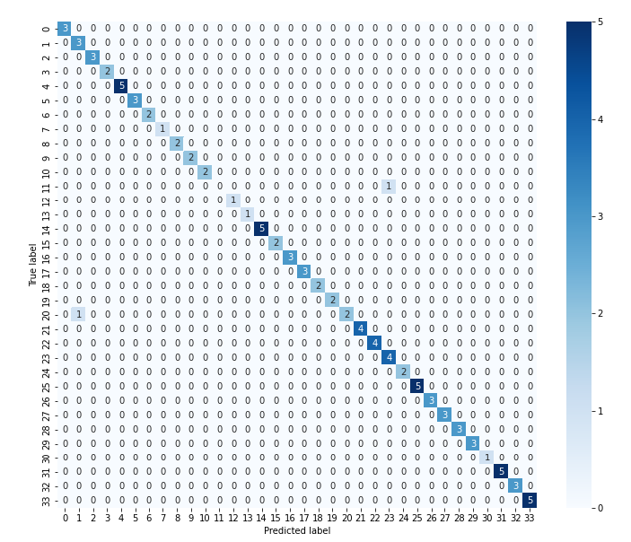

# Speaker Recognition

This project is part of my engineering thesis "Automatic Identity Recognition Using Speech Biometric". The main assumptions of the project include creating the most effective solution that will enable the identification of 34 speakers based on 14 recordings of individual words from each of them. The overall process was as shown in the diagram below [1]. 

## [Data Selection](https://github.com/Swedeling/Portfolio/blob/main/SpeakerRecognition/data_selection.ipynb)

The data used during the project implementation comes from the free [Common Voice](https://commonvoice.mozilla.org) database. It is an open source collection of recordings of the human voice in various languages. A database of single-word recordings in English was selected for this project. The words spoken are "zero", "one", "two", "three", "four", "five", "six", "seven", "eight", "nine", "yes", "no", "Hey", "Firefox". Such a selection of words is due to the fact that they are universal and most often used for user verification (for example with a PIN code), which is one of the applications of speaker recognition systems.
The entire collection contained 16,285 short recordings of words spoken by various users. Therefore, I decided to standardize and limit them. In this [section](https://github.com/Swedeling/Portfolio/blob/main/SpeakerRecognition/data_selection.ipynb) you can find my data selection process. 

## [Silence Removing](https://github.com/Swedeling/Portfolio/blob/main/SpeakerRecognition/feature_extraction.ipynb)
Voice data can be divided into three segments: speech segment, silence segment, and background noise. Depending on the recording conditions, their ratio may be different. If you want to obtain high classification results, you should take care of the "purity" of the signal. In order to extract the voice parts, I decided to use an endpoint detection algorithm and unnecessary parts removing. For the purposes of this project, the algorithm described in "A New Silence Removal and Endpoint Detection Algorithm for Speech and Speaker Recognition Applications" was used [2]. 

Its operation is presented in the diagram below.

In this [section](https://github.com/Swedeling/Portfolio/blob/main/SpeakerRecognition/feature_extraction.ipynb) you can find my implementaion of it. 

A sample result of the operation:

## [Feature extraction](https://github.com/Swedeling/Portfolio/blob/main/SpeakerRecognition/feature_extraction.ipynb)
The selection of the appropriate characteristics has a key impact on the classification score. As mentioned earlier, there are many methods for parameterizing speech. A literature review has shown that the best results are achieved with the use of Mel Scale Cepstral Frequency Coefficients (MFCC), which is why they were used in the project. In addition, additional parameters were selected for the model to be more efficient. The Python Librosa package was used to calculate the parameters. It is a package designed to analyze music and audio recordings. It helps to visualize signals and carry out calculations of parameters that enable the characteristics of the recording. 

## Classification
I decided to compare two different classifiers: logistic regression and MLP neural network. The purpose of this procedure was to check the advantages and disadvantages of these decision-making instruments, which differ mainly in the nature, assumptions and amount of information provided. This will allow you to assess which of them will work better in the created system.

### [Logistic Regression](https://github.com/Swedeling/Portfolio/blob/main/SpeakerRecognition/LR.ipynb)
Classification using this method was made possible by the machine learning library for Python Scikit-learn. For the purposes of the project, the above-mentioned collection of 476 recordings belonging to 34 people was selected from the database. The data was divided into a training set (80% - 381 recordings) and a test set (20% - 95 recordings)

### [Neural Network](https://github.com/Swedeling/Portfolio/blob/main/SpeakerRecognition/NN.ipynb)
A neural network was also designed to be used as a classifier. The Keras library was used during the implementation. It is an open source library dedicated to building neural networks for deep learning. It uses Google's TensorFlow as a backend. The learning parameters and the network structure were selected on the basis of the results observation, using the "trial and error" method. When they were satisfactory, the design process was completed. The network consists of two types of layers: dense (Dense) and exclusions (Dropout) with different parameters. It was decided to use the "relu" activation function within the network due to the fact that it offers the best performance. On the output, however, the activation function "Softmax" was selected, which is best for solving classification problems.

## Results
The analysis of the results was performed using the most popular validation metrics. Accuracy, Recall, Precision and F1-score were used to evaluate the classification models. 

Both classifiers gave similar results, 98% (LR) and 96% (NN). Logistic regression turned out to be a better choice in this case, not only because of better efficiency but also shorter learning time. Moreover, the obtained results were certainly influenced by the division of the set. It is possible that if other ratios were used (e.g. 80-10-10) the efficiency of the system could be higher.

Although the solution is based on a small and specific set of data, the results achieved are satisfactory. The use of such a system is possible in reality. However, the proposed system can still be improved as the goal is to achieve an efficiency of 100%.

The confusion matrices are shown below.

Confusion matrix for logistic regression:

Confusion matrix for Neural Network:

## Bibliography

[1] Mohd Hanifa, Rafizah, Khalid Isa, i Shamsul Mohamad. „A Review on Speaker Recognition: Technology and Challenges”. Computers & Electrical Engineering 90 (marzec 2021): 107005. https://doi.org/10.1016/j.compeleceng.2021.107005.

[2] Saha, Goutam & Chakroborty, S.S. & Senapati, Suman. (2005). A New Silence Removal and Endpoint Detection Algorithm for Speech and Speaker Recognition Applications.

[3] Reynolds, Douglas A. „An overview of automatic speaker recognition technology”. W IEEE International Conference on Acoustics Speech and Signal Processing, IV-4072-IV–4075. Orlando, FL, USA: IEEE, 2002. https://doi.org/10.1109/ICASSP.2002.5745552.

[4] Mohd Hanifa, Rafizah, Khalid Isa, i Shamsul Mohamad. „A Review on Speaker Recognition: Technology and Challenges”. Computers & Electrical Engineering 90 (marzec 2021): 107005. https://doi.org/10.1016/j.compeleceng.2021.107005.

[5] Jahangir, Rashid, Ying Wah Teh, Henry Friday Nweke, Ghulam Mujtaba, Mohammed Ali Al-Garadi, i Ihsan Ali. „Speaker Identification through Artificial Intelligence Techniques: A Comprehensive Review and Research Challenges”. Expert Systems with Applications 171 (czerwiec 2021): 114591. https://doi.org/10.1016/j.eswa.2021.114591.